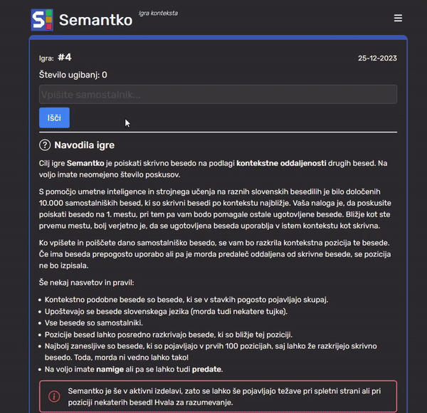

# [Semantko: Igra konteksta](https://semantko-frontend.onrender.com/)

Na voljo na:
[semantko.si](https://semantko-frontend.onrender.com/)

***

## **Navodila igre**

Semantko je igra konteksta, katere cilj je odkriti skrivno besedo na podlagi kontekstne bližine drugih besed.

S pomočjo umetne inteligence in strojnega učenja na raznih slovenskih besedilih je bilo določenih 10.000 samostalniških besed, ki so skrivni besedi po kontekstu najbližje. Vaša naloga je, da poskusite poiskati besedo na 1. mestu, pri tem pa vam bodo pomagale ostale ugotovljene besede. Bližje kot ste prvemu mestu, bolj verjetno je, da se ugotovljena beseda uporablja v istem kontekstu kot skrivna.

Ko vpišete in poiščete dano samostalniško besedo, se vam bo razkrila kontekstna pozicija te besede. Če ima beseda prepogosto uporabo ali pa je morda predaleč oddaljena od skrivne besede, se pozicija ne bo izpisala.

Še nekaj nasvetov in pravil:

- Kontekstno podobne besede so besede, ki se v stavkih pogosto pojavljajo skupaj.
- Upoštevajo se besede slovenskega jezika (morda tudi nekatere tujke).
- Vse besede so samostalniki.
- Pozicije besed lahko posredno razkrivajo besede, ki so bližje tej poziciji.
- Najbolj zanesljive so besede, ki so pojavljajo v prvih 100 pozicijah, saj lahko že razkrijejo skrivno besedo. Toda, morda ni vedno lahko tako!
- Na voljo imate namige ali pa se lahko tudi predate.

***

## **Informacije**

S pomočjo umetne inteligence in strojnega učenja na raznih slovenskih besedilih so bile določene kontekstne oddaljenosti slovenskih besed. Njihova natančnost morda ni najboljša, toda določene besede skupaj se med seboj smiselno povezujejo.

Igra je bila inspirirana na podlagi drugih podobnih kontekstnih iger v drugih jezikih ([Semantle](https://semantle.com/), [Contexto.me](https://contexto.me/)), katere cilj je ugotoviti skrivno besedo na podlagi kontekstne oddaljenosti drugih besed.

> Semantko je v izdelavi, zato se lahko še pojavljajo težave pri spletni strani ali pri poziciji nekaterih besed! Hvala za razumevanje. Zaradi neaktivnosti se dnevne skrivne besede ne menjavajo, zato je trenutno samo na voljo ena igra, morda bo v prihodnosti na voljo izbira dnevi.
V primeru odkritja napak, hroščev ali kakšnih predlogov se lahko obrnete na [Github](https://github.com/martinkorelic/semantko/issues) stran.

> Martin Korelič @ 2023