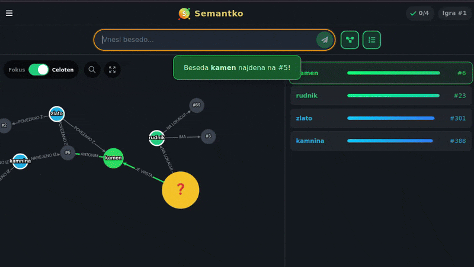

# [Semantko: Slovenska besedna uganka](https://semantko.si)

Na voljo na:
[semantko.si](https://semantko.si)

***

## **Odkrij povezave, ujemi skrivnost!**

Semantko — slovenska besedna uganka. Odkrij skrivno besedo z raziskovanjem omrežja pojmov in semantičnih povezav. Vsak dan nova igra, vsak dan nova skrivnost!

***

## **Kaj je Semantko?**

Semantko je napredna slovenska igra konteksta, kjer je cilj odkriti skrivno besedo na podlagi semantične bližine drugih besed in raziskovanja omrežja pojmov. Igra temelji na umetni inteligenci in velikem omrežju slovenskih pojmov, ki omogoča poglobljeno raziskovanje povezav med besedami.

***

## **Navodila igre**

1. **Cilj igre:** Odkrij skrivno besedo, ki je na vrhu lestvice semantične bližine.
2. **Vnašanje besed:** Vnašaj slovenske samostalnike v ednini (npr. "miza", "avto", "upanje"). Vsaka ugibana beseda se prikaže na lestvici in v omrežju povezav.
3. **Lestvica:** Vsaka beseda dobi svojo uvrstitev glede na bližino skrivni besedi. Nižja številka pomeni večjo podobnost.
4. **Omrežje povezav:** Prikazuje, kako so tvoje ugibane besede povezane s skrivno besedo in med seboj. Raziskuj omrežje za dodatne namige!
5. **Vrste povezav:** Omrežje temelji na različnih vrstah semantičnih povezav (npr. nadpomenke, sopomenke, del-celota, asociacije).
6. **Namigi:** Uporabi namige ali preglej pretekle igre za dodatno pomoč.
7. **Pravila:** Upoštevajo se le slovenski samostalniki v ednini. Prepogoste ali preveč oddaljene besede niso prikazane.

### **Dodatne funkcionalnosti**

- **Pretekle igre:** Preglej in ponovno igraj pretekle izzive.
- **Nastavitve:** Prilagodi število prikazanih vozlišč v omrežju, vključi temni način ali izbriši zgodovino.
- **Vrste povezav:** Spoznaj različne vrste semantičnih povezav v posebnem pogledu.
- **Napredna vizualizacija:** Omrežje omogoča povečavo, fokusiranje in prilagajanje pogleda.

***

## **Tehnične informacije**

- **Omrežje pojmov:** Temelji na slovenskem omrežju **PojemNet** (50.000+ pojmov, 500.000+ povezav - kmalu javno dostopen).
- **Algoritmi:** Uporabljeni so napredni algoritmi umetne inteligence in analize omrežij za izračun bližin in povezav.
- **Navdih:** Igra je navdihnjena po [Semantle](https://semantle.com/) in [Contexto.me](https://contexto.me/), a z edinstvenim poudarkom na vizualizaciji omrežja in slovenskih podatkih.

***

> Predlogi in prijava napak na [Github](https://github.com/martinkorelic/semantko/issues).

> Martin Korelič @ 2026  

***